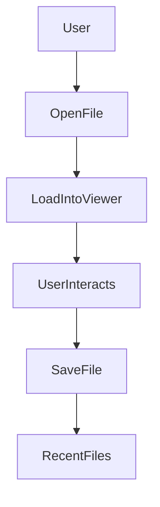

# Flutter PDF Viewer & Editor - Developer Specification

## 1. Overview
This document specifies the requirements and implementation details for a **cross-platform** (Android & iOS) **PDF Viewer & Editor** using Flutter. The app will allow users to **open, view, annotate, highlight, delete pages, and save** PDFs efficiently.

## 2. Tech Stack & Libraries
- **Framework:** Flutter
- **PDF Rendering & Editing:**
  - [`syncfusion_flutter_pdfviewer`](https://pub.dev/packages/syncfusion_flutter_pdfviewer) - For displaying PDFs
  - [`syncfusion_flutter_pdf`](https://pub.dev/packages/syncfusion_flutter_pdf) - For modifying PDFs (annotations, deleting pages, exporting edited files)
- **State Management:** Provider or Riverpod
- **Storage Access:** `path_provider` and `permission_handler` for file management
- **UI Components:** Material UI + Custom Theming for modern look
- **Dark Mode Support:** Integrated with Flutter theme
- **Multi-language Support:** Supports **English, Spanish, French, German, Chinese, and Vietnamese**

## 3. Functional Requirements
### 3.1 PDF Viewing
- ✅ Open PDF files from local storage
- ✅ Smooth scrolling & pinch-to-zoom
- ✅ Double-tap to zoom in/out
- ✅ Support for large PDFs (>50MB) with optimized loading
- ✅ Ability to switch pages by:
  - Swiping left/right
  - Scrolling vertically
  - Using "Previous/Next" buttons
- ✅ Auto-remember last viewed page

### 3.2 PDF Editing
- ✅ **Annotations:** Add text notes to any position in the PDF
- ✅ **Highlighting:** Select and highlight text (default: yellow, 50% transparency)
- ✅ **Delete Pages:** Remove pages from the PDF with a confirmation prompt
- ✅ **Save & Export:**
  - Edited files saved as `document_edited(1).pdf`, `document_edited(2).pdf`… in the same directory as the original file
  - Automatic filename handling to avoid overwriting
- ✅ **Undo Support:**
  - Undo last annotation or highlight before saving
  - Undo last page deletion before saving

### 3.3 File Management
- ✅ **Recent Files List:**
  - Store up to 10 recently opened files
  - Sorted by most recently accessed
  - Auto-remove oldest file when exceeding limit
- ✅ **Search & Filter:**
  - Search files by name in Recent Files
  - Sort by last modified date
- ✅ **Delete from Recent Files:** Swipe left to remove an entry (does not delete the actual file)

### 3.4 File Sharing
- ✅ **Share PDFs via:** Email, Zalo, Messenger, Google Drive, etc.
- ✅ **Open Folder Containing File:** Allow users to navigate to the file location in the device storage
- ✅ **Rename Files Before Saving:** Optional pop-up allowing users to customize filenames

### 3.5 Security & Error Handling
- ✅ **Password-Protected PDFs:**
  - Prompt user to enter password before opening
  - If incorrect, allow retry
- ✅ **Corrupt PDF Handling:**
  - If pages fail to load, show a warning instead of crashing
  - Let user continue viewing other pages
- ✅ **Large Files (>50MB):**
  - Show a warning: *"This file may take longer to load. Continue?"*
  - Display a progress indicator while loading
- ✅ **Slow Scrolling Protection:**
  - Prevent excessive scrolling speed to avoid lag/crash
  - Auto-limit rendering frequency when needed
- ✅ **Handling Unsaved Changes:**
  - If user exits while editing, auto-save as a draft
  - On reopening, ask: *"Resume last unsaved session?"*

## 4. App Architecture
### 4.1 Data Flow

### 4.2 Storage Strategy
- Files stored in the **same directory** as the original PDF
- Recent Files list stored using `shared_preferences`
- Temporary unsaved changes stored in local cache (auto-clean on app restart)

## 5. UI/UX Design
### 5.1 General Design Principles
- **Minimalist & Modern UI:** Clean, uncluttered layout
- **Material 3 Styling:** Rounded corners, smooth animations
- **Dark Mode Support:** Auto-switch based on system settings
- **Multi-language UI:** Supports switching between English, Spanish, French, German, Chinese, and Vietnamese

### 5.2 Main Screens
#### **Home Screen**
- Large "Open File" button centered when no file is open
- List of Recent Files displayed in a modern card UI
- Floating Action Button (FAB) for quick access

#### **PDF Viewer Screen**
- **Toolbar (Top):**
  - "Open File" button
  - "Back" button
  - Page indicator ("Page X/Y")
- **Floating Toolbar (Bottom):**
  - Annotate (📝)
  - Highlight (🟡)
  - Delete Page (🗑️)
  - Save (💾)
- **Auto-hide toolbar after 3 seconds of inactivity**

### 5.3 Animations & Transitions
- **Smooth Page Transitions**: Crossfade effect when switching pages
- **FAB Button Animations**: Expands when tapped
- **Undo Snackbar Animation**: Slide-up effect

## 6. Error Handling Strategy
| Error Scenario | Handling Approach |
|---------------|----------------|
| File missing in Recent Files | Show error and remove from list |
| File corrupted | Show error and allow opening another file |
| Password-protected PDF | Ask user for password, allow retry |
| Large file (>50MB) | Show warning and optimize rendering |
| Unsaved changes | Auto-save as draft and ask to restore on next open |

## 7. Testing Plan
### 7.1 Functional Testing
| Test Case | Expected Result |
|-----------|----------------|
| Open PDF file | Successfully loads, smooth scrolling |
| Open large PDF (>50MB) | Warning displayed, loads with progress indicator |
| Pinch & Double-tap Zoom | Zooming works smoothly |
| Swipe & Button Navigation | Page switching works in all modes |
| Add Annotations | Annotations appear correctly and are saved |
| Highlight Text | Highlight works, maintains transparency |
| Delete Page | Page removed, undo available before saving |
| Save Edited File | New file created without overwriting original |

## 8. Next Steps
- ✅ Confirm feature priorities with stakeholders
- ✅ Assign tasks to developers
- ✅ Set up project repository & CI/CD pipeline
- ✅ Begin implementation using Syncfusion packages
- ✅ Perform UI/UX testing before final release

---
This document ensures **seamless execution** of the project while maintaining **high usability, performance, and stability**. Developers can now start implementing the app immediately! 🚀